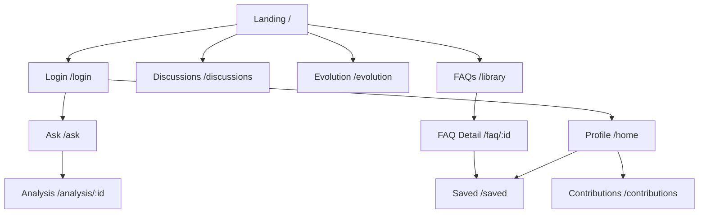
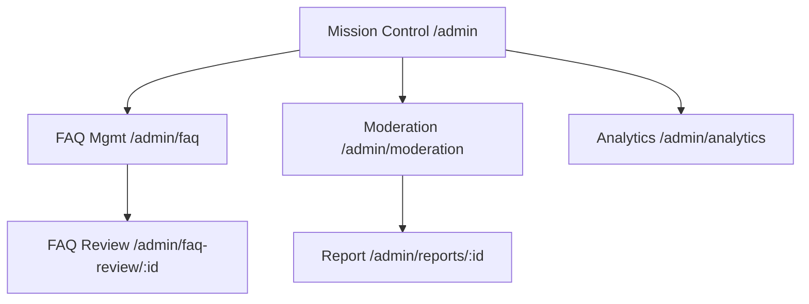

# CrowdMind — Navigation & screen guide

Use this with `docs/SCREEN_MAP.md` and the **Screens** picker (bottom-right in dev) to demo the app.

---

## User vs admin order (recommended demo flow)

### Guest (no login)

1. **Landing** `/` — marketing, trending FAQs, peer reviews, knowledge cycle CTA  
2. **Knowledge Repository** `/library` — browse/search FAQs (public)  
3. **FAQ Detail** `/faq/1` — read one FAQ (public)  
4. **Discussions** `/discussions` + **Thread** `/discussions/d1` — read threads (public)  
5. **Knowledge Evolution** `/evolution` — how FAQs evolve over time (public)  
6. **Login** `/login` — required before asking, posting, or personal hub  

### Logged-in user (`user@crowdmind.ai`)

7. **Ask Question** `/ask` → **AI Analysis** `/analysis/new`  
8. **Create Discussion** `/discussions/new`  
9. **Profile** `/home` — identity, tabs (questions/answers/…), heatmap, badges  
10. **My Contributions** `/contributions` — activity feed + impact sidebar (distinct from profile)  
11. **Saved Knowledge** `/saved` — bookmarked FAQs (workspace layout with left sidebar)  
12. **Notifications** `/notifications`  

### Admin (`admin@crowdmind.ai`)

13. **Mission Control** `/admin`  
14. **FAQ Management** `/admin/faq` → **FAQ Candidate Review** `/admin/faq-review/1024`  
15. **Moderation Queue** `/admin/moderation` → **Report Investigation** `/admin/reports/r1`  
16. **Platform Intelligence** `/admin/analytics`  
17. **Settings** `/admin/settings`  

---

## Top navigation (all main user screens)

| Label | Route | Auth |
|-------|-------|------|
| CrowdMind (logo) | `/` | Public |
| FAQs | `/library` | Public |
| Discussions | `/discussions` | Public |
| Ask Question | `/ask` | Login required (guard → `/login`) |
| Analytics | `/evolution` | Public (Knowledge Evolution, **not** admin dashboard) |

Landing CTAs:

| Button | Route |
|--------|-------|
| Explore FAQs | `/library` |
| Ask a Question | `/ask` (login if guest) |
| Get Started Now | `/login` |
| Learn Our Methodology | `/evolution` |

---

## Profile vs My Contributions vs Saved Knowledge

| Screen | Route | Purpose |
|--------|-------|---------|
| **User Profile** | `/home` | Who you are: bio, expertise, reputation, tabs of your content, achievements, rank |
| **My Contributions** | `/contributions` | What you did: unified feed (questions, answers, FAQs, discussions), impact metrics, heatmap |
| **Saved Knowledge** | `/saved` | What you bookmarked for later reading |

**Profile** and **Contributions** share the same top nav as the rest of the app. **Saved Knowledge** intentionally uses a **workspace shell**: left sidebar (collections, filters) + main list. That is OK — it signals “personal library” mode. Entry points:

- Avatar / profile menu → **Saved Knowledge** (when wired in production)  
- Profile page link “Saved” / bookmark actions on FAQ Detail  
- Direct route `/saved` (login required)  

---

## Knowledge Evolution (`/evolution`)

- **Not** the marketing landing page.  
- Shows version timeline, health metrics, and knowledge diff viewer.  
- Linked from top nav **Analytics** on user-facing screens and from landing **Learn Our Methodology**.  
- Admin has a separate **Platform Intelligence** screen at `/admin/analytics`.  

---

## FAQ Candidate Review (screen 21)

- **Route:** `/admin/faq-review/:id` (demo: `/admin/faq-review/1024`)  
- **Who:** Admin / moderator only  
- **What:** Approve, edit, or reject an AI-generated FAQ candidate; view sources and diff vs legacy FAQ  
- **Opened from:** FAQ Management queue, Mission Control alerts, or “Review” actions on pending candidates  

---

## Moderator (plain language)

A **moderator** is a trusted admin who reviews AI output before it becomes public FAQ. They use **FAQ Candidate Review** and **Moderation Queue**, not the normal “ask a question” flow.

---

## Mermaid — high-level user flow

